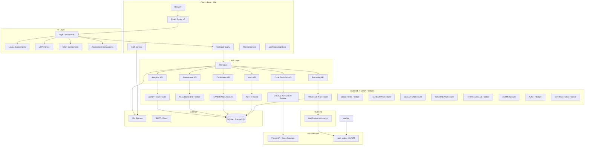
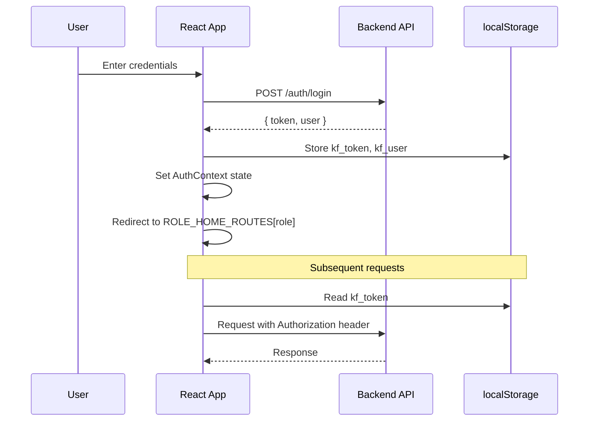
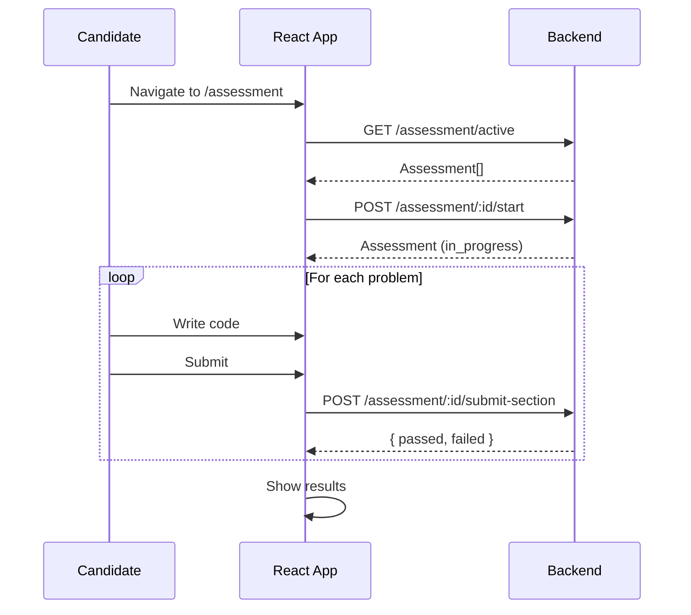
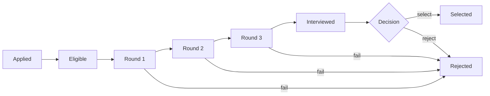
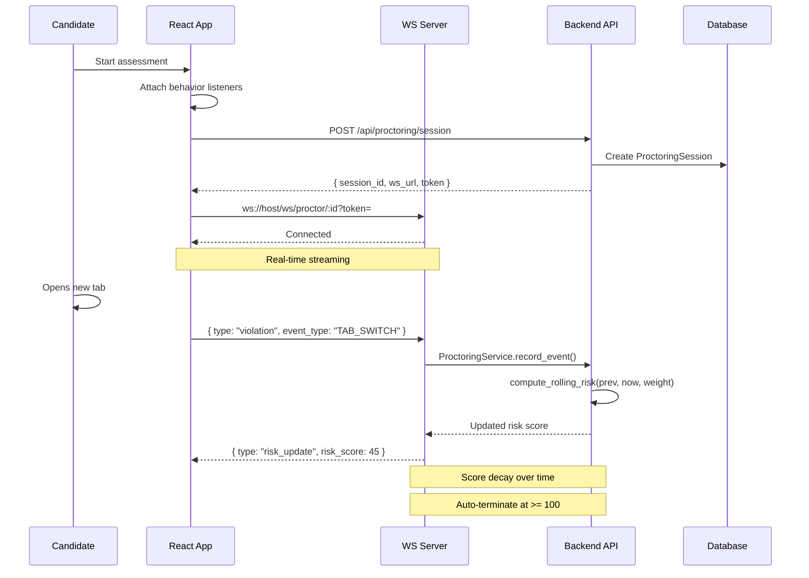

# Knowledge Factory - Technical Documentation

> Comprehensive documentation for the Knowledge Factory intern hiring platform — a full-stack role-based recruitment system with AI-powered proctoring, code execution, and analytics.

---

## Table of Contents

1. [Architecture Overview](#1-architecture-overview)
2. [System Architecture Diagram](#2-system-architecture-diagram)
3. [Technology Stack](#3-technology-stack)
4. [Project Structure](#4-project-structure)
5. [Backend Features](#5-backend-features)
6. [Routing & Navigation](#6-routing--navigation)
7. [API Reference](#7-api-reference)
8. [Type System](#8-type-system)
9. [Authentication & Authorization](#9-authentication--authorization)
10. [Proctoring System](#10-proctoring-system)
11. [Code Execution Engine](#11-code-execution-engine)
12. [audi_video Microservice](#12-audi_video-microservice)
13. [Component Library](#13-component-library)
14. [State Management](#14-state-management)
15. [Design System](#15-design-system)
16. [Environment Configuration](#16-environment-configuration)
17. [Development Guide](#17-development-guide)
18. [Role-Based Access Control Matrix](#18-role-based-access-control-matrix)
19. [Data Flow Diagrams](#19-data-flow-diagrams)
20. [Troubleshooting](#20-troubleshooting)
21. [Production Checklist Progress](#21-production-checklist-progress)
22. [Assumptions & Gaps](#22-assumptions--gaps)

---

## 1. Architecture Overview

Knowledge Factory is a **role-based intern hiring platform** that streamlines high-volume campus recruitment. It supports five user roles, each with dedicated views and workflows.

| Role | Purpose | Home Route |
|------|---------|------------|
| `candidate` | Takes assessments, views portal | `/portal` |
| `hr` | Manages candidates, reviews analytics | `/dashboard` |
| `interviewer` | Conducts interviews, submits feedback | `/interview` |
| `admin` | Full HR + interviewer access | `/dashboard` |
| `superadmin` | Platform-wide org management | `/superadmin` |

The application follows a **single-page application (SPA)** architecture with client-side routing, JWT-based authentication, a design-system-driven component library, and a modular backend organized by feature.

### Repo Layout

| Directory | Purpose |
|-----------|---------|
| `app/` | React SPA frontend (Vite + TypeScript) |
| `backend/` | FastAPI backend with modular features |
| `audi_video/` | Standalone CV/audio AI microservice for proctoring |
| `auth/` | Auth testing fixtures and tokens |
| `docs/` | Architecture, API, ops, and setup documentation |
| `scripts/` | Utility scripts |
| `screenshots/` | Proctoring evidence screenshots |

---

## 2. System Architecture Diagram



---

## 3. Technology Stack

### Frontend

| Category | Technology | Version |
|----------|-----------|---------|
| Framework | React | 19.2.x |
| Language | TypeScript | 6.0.x |
| Build Tool | Vite | 8.0.x |
| Routing | React Router DOM | 7.14.x |
| Data Fetching | TanStack React Query | 5.99.x |
| Styling | Tailwind CSS | 4.2.x |
| Icons | Lucide React | 1.8.x |
| Utility | clsx | 2.1.x |
| Linting | ESLint | 9.39.x |

### Backend

| Category | Technology |
|----------|-----------|
| Framework | FastAPI (async) |
| Language | Python 3.11+ |
| Database | SQLite + aiosqlite (local) / PostgreSQL (production) |
| ORM | SQLAlchemy 2.0 (async) |
| Migrations | Alembic |
| Auth | JWT (python-jose) + bcrypt (passlib) |
| Email | aiosmtplib + OTP |
| File Validation | python-magic + Pillow |
| WebSocket | FastAPI WebSocket |
| Code Sandbox | Piston API (external) |
| Analytics | Pandas + NumPy |

### audi_video Microservice

| Category | Technology |
|----------|-----------|
| AI Vision | YOLO (ONNX) — face detection, head pose, phone detection |
| Speech-to-Text | Indic Conformer 600M (ONNX, RNNT) |
| LLM Analysis | OpenAI-compatible API for violation analysis |
| Streaming | WebSocket with frame/audio chunking |
| Benchmark | FPS, latency, stress testing tools |

---

## 4. Project Structure

```
.
├── app/                                  # React SPA Frontend
│   ├── public/
│   │   ├── favicon.svg
│   │   └── icons.svg
│   ├── src/
│   │   ├── api/                          # API client & endpoint modules
│   │   │   ├── client.ts                 # Base HTTP client
│   │   │   ├── auth.ts                   # Auth endpoints
│   │   │   ├── candidates.ts             # Candidate CRUD
│   │   │   ├── assessment.ts             # Assessment & feedback
│   │   │   └── analytics.ts              # Analytics & org management
│   │   ├── assets/
│   │   │   └── vite.svg
│   │   ├── components/
│   │   │   ├── ui/                       # Design system primitives
│   │   │   ├── layout/                   # Shell & navigation
│   │   │   ├── charts/                   # Data visualization
│   │   │   └── assessment/               # Assessment-specific widgets
│   │   ├── contexts/
│   │   │   ├── AuthContext.tsx
│   │   │   └── ThemeContext.tsx
│   │   ├── hooks/                        # Custom hooks + TanStack queries
│   │   │   ├── useAuth.ts
│   │   │   ├── useCandidates.ts
│   │   │   ├── useAssessment.ts
│   │   │   ├── useAnalytics.ts
│   │   │   ├── useProctoring.ts          # Proctoring lifecycle + violations
│   │   │   ├── useCodeExecution.ts
│   │   │   ├── useHiringCycles.ts
│   │   │   ├── useQuestion.ts
│   │   │   ├── useScreening.ts
│   │   │   └── useWorkflow.ts
│   │   ├── services/
│   │   │   └── proctoring.ts             # Proctoring REST/WS service
│   │   ├── pages/                        # Route-level components
│   │   ├── routes/
│   │   │   └── ProtectedRoute.tsx
│   │   ├── types/
│   │   │   └── index.ts
│   │   ├── utils/
│   │   │   ├── cn.ts
│   │   │   └── roles.ts
│   │   ├── App.tsx
│   │   ├── main.tsx
│   │   └── index.css
│   ├── index.html
│   ├── vite.config.ts
│   ├── tsconfig.json / tsconfig.app.json / tsconfig.node.json
│   ├── eslint.config.js
│   └── package.json
│
├── backend/                              # FastAPI Backend
│   ├── app/
│   │   ├── main.py                       # App entrypoint
│   │   ├── config.py                     # Settings (pydantic-settings)
│   │   ├── database.py                   # Async session factory
│   │   ├── dependencies.py               # Dependency injection
│   │   ├── core/                         # Security, logging, middleware
│   │   ├── middleware/                    # Auth middleware
│   │   ├── integrations/                 # 3rd-party service wrappers
│   │   ├── services/                     # Shared business services
│   │   ├── websockets/
│   │   │   ├── proctoring.py             # Real-time proctoring WS endpoint
│   │   │   └── dashboard.py              # Dashboard WebSocket
│   │   └── features/                     # Feature modules (modular)
│   │       ├── auth/                     # Registration, login, OTP, password mgmt
│   │       ├── candidates/               # Candidate CRUD + bulk upload
│   │       ├── assessments/              # Assessment lifecycle
│   │       ├── analytics/                # Dashboards, funnel, reports
│   │       ├── proctoring/               # Risk engine, monitoring, evidence
│   │       ├── code_execution/           # Piston API integration
│   │       ├── questions/                # Question bank + AI generation
│   │       ├── screening/                # Resume screening pipeline
│   │       ├── selection/                # Selection workflow
│   │       ├── interviews/               # Interview feedback
│   │       ├── hiring_cycles/            # Hiring cycle management
│   │       ├── admin/                    # Admin schemas
│   │       ├── audit/                    # Audit logging
│   │       ├── notifications/            # Notifications
│   │       ├── jobs/                     # Background job routes
│   │       └── superadmin/               # Platform management
│   ├── alembic/                          # Database migrations
│   ├── tests/
│   ├── docker/
│   ├── uploads/
│   ├── screenshots/
│   ├── pyproject.toml
│   ├── requirements.txt
│   └── Dockerfile
│
├── audi_video/                           # CV/Audio AI Microservice
│   ├── app/
│   │   ├── main.py
│   │   ├── core/
│   │   ├── models/
│   │   │   └── indic-conformer-600m/
│   │   ├── routers/
│   │   ├── schemas/
│   │   ├── services/                     # YOLO, STT, LLM, risk, session
│   │   └── utils/
│   ├── tests/
│   ├── tools/                            # Optimization, load testing
│   ├── benchmark/                        # Performance benchmarks
│   └── Dockerfile
│
├── docs/
│   ├── api/
│   ├── architecture/
│   ├── diagrams/
│   ├── memory/
│   ├── ops/
│   ├── reports/
│   └── setup/
│
├── auth/                                 # Auth test fixtures + tokens
├── scripts/
├── screenshots/
└── README.md
```

---

## 5. Backend Features

The backend is organized into **feature modules** under `backend/app/features/`, each following a consistent pattern:

```
features/<name>/
├── __init__.py
├── routes.py         # FastAPI routers (grouped under /api/<name>)
├── schemas.py        # Pydantic request/response models
├── models.py         # SQLAlchemy ORM models
└── service.py        # Business logic (optional)
```

| Feature | Purpose | Endpoints |
|---------|---------|-----------|
| `auth` | JWT registration, login, OTP, password reset, account deletion | `/api/auth/*` |
| `candidates` | Candidate CRUD, bulk upload, status management | `/api/candidates/*` |
| `assessments` | Assessment lifecycle, section submissions | `/api/assessment/*` |
| `analytics` | Dashboard metrics, funnel, college/branch breakdown | `/api/analytics/*` |
| `proctoring` | Session init, event recording, risk scoring, auto-termination | `/api/proctoring/*` |
| `code_execution` | Remote code sandbox (Piston API) for multiple languages | `/api/code-execution/*` |
| `questions` | Question bank CRUD + AI-assisted question generation | `/api/questions/*` |
| `screening` | Resume screening pipeline | `/api/screening/*` |
| `selection` | Candidate selection workflow | `/api/selection/*` |
| `interviews` | Interview feedback, scoring | `/api/interviews/*` |
| `hiring_cycles` | Hiring cycle CRUD | `/api/hiring-cycles/*` |
| `admin` | Admin panel schemas | `/api/admin/*` |
| `audit` | Audit trail for candidate assessments | `/api/audit/*` |
| `notifications` | Notification delivery | `/api/notifications/*` |
| `jobs` | Background job management | `/api/jobs/*` |
| `superadmin` | Organization management, platform-wide settings | `/api/superadmin/*` |

---

## 6. Routing & Navigation

### Route Map

| Path | Component | Allowed Roles | Type |
|------|-----------|---------------|------|
| `/` | `Landing` | Public | Public |
| `/login` | `Login` | Public | Public |
| `/register` | `Register` | Public | Public |
| `/verify-otp` | `OTPVerification` | Public | Public |
| `/forgot-password` | `ForgotPassword` | Public | Public |
| `/portal` | `Portal` | `candidate` | Protected |
| `/assessment` | `Assessment` | `candidate` | Protected |
| `/dashboard` | `Dashboard` | `hr`, `admin`, `superadmin` | Protected |
| `/candidates/:id` | `CandidateDetail` | `hr`, `admin`, `interviewer`, `superadmin` | Protected |
| `/interview` | `InterviewPanel` | `interviewer`, `admin` | Protected |
| `/selection` | `SelectionPanel` | `hr`, `admin`, `superadmin` | Protected |
| `/analytics` | `AnalyticsDashboard` | `hr`, `admin`, `superadmin` | Protected |
| `/superadmin` | `SuperAdminPanel` | `superadmin` | Protected |
| `*` | `AuthRedirect` | - | Fallback |

### AuthRedirect Behavior

`AuthRedirect` inspects the current auth context:
- **Authenticated** → redirects to `ROLE_HOME_ROUTES[role]`
- **Unauthenticated** → redirects to `/login`

### ProtectedRoute Component

```typescript
// src/routes/ProtectedRoute.tsx
interface ProtectedRouteProps {
  allowedRoles: Role[];
  children: React.ReactNode;
}
```

Wraps protected routes. Checks `useAuth().role` against `allowedRoles`. Unauthorized users are redirected to their role's home route.

---

## 7. API Reference

### Base Client

**File:** `src/api/client.ts`

All API calls go through the `api` object, which wraps `fetch` with:
- Auto-injected `Authorization: Bearer ***` header from `localStorage.kf_token`
- Auto-injected `Content-Type: application/json`
- Query parameter serialization via `params` option
- Error handling: parses JSON error body, throws `Error` with `message` or `HTTP {status}`

| Method | Signature |
|--------|-----------|
| `api.get<T>` | `(endpoint, options?) → Promise<T>` |
| `api.post<T>` | `(endpoint, data?, options?) → Promise<T>` |
| `api.put<T>` | `(endpoint, data?, options?) → Promise<T>` |
| `api.patch<T>` | `(endpoint, data?, options?) → Promise<T>` |
| `api.delete<T>` | `(endpoint, options?) → Promise<T>` |

**Base URL:** `import.meta.env.VITE_API_URL` or `/api` fallback.

---

### Auth API

**File:** `src/api/auth.ts`

| Endpoint | Method | Body / Params | Response |
|----------|--------|---------------|----------|
| `/auth/register` | POST | `{ name, email, password, resume? }` (FormData if resume) | `{ token, user }` |
| `/auth/login` | POST | `{ email, password }` | `{ token, user }` |
| `/auth/verify-otp` | POST | `{ email, otp }` | `{ token, user }` |
| `/auth/forgot-password` | POST | `{ email }` | `{ message }` |
| `/auth/reset-password` | POST | `{ token, password }` | `{ message }` |
| `/auth/me` | GET | - | `User` |
| `/auth/confirm-password` | POST | `{ password }` | `{ confirmed }` |
| `/auth/delete-account` | DELETE | - | `{ message }` |

> **Note:** Registration with resume uses raw `fetch` with `FormData` instead of the JSON client.

---

### Candidates API

**File:** `src/api/candidates.ts`

| Endpoint | Method | Body / Params | Response |
|----------|--------|---------------|----------|
| `/candidates` | GET | `?page=&pageSize=&status=&branch=&college=&search=` | `PaginatedResponse<Candidate>` |
| `/candidates/:id` | GET | - | `Candidate` |
| `/candidates/me` | GET | - | `Candidate` |
| `/candidates/:id/status` | PATCH | `{ status }` | `Candidate` |
| `/candidates/bulk-upload` | POST | `FormData { file }` | Upload result |

---

### Assessment API

**File:** `src/api/assessment.ts`

| Endpoint | Method | Body / Params | Response |
|----------|--------|---------------|----------|
| `/assessment/:id/start` | POST | - | `Assessment` |
| `/assessment/:id/submit-section` | POST | `{ problemId, code }` | `{ passed, failed }` |
| `/assessment/:id` | GET | - | `Assessment` |
| `/assessment/active` | GET | - | `Assessment[]` |
| `/candidates/:id/feedback` | POST | `{ technicalScore, communicationScore, recommendation, notes }` | - |

---

### Analytics API

**File:** `src/api/analytics.ts`

| Endpoint | Method | Body / Params | Response |
|----------|--------|---------------|----------|
| `/analytics/funnel` | GET | `?organizationId=` | `FunnelData` |
| `/analytics/dashboard` | GET | `?organizationId=` | `AnalyticsData` |
| `/superadmin/organizations` | GET | - | `Organization[]` |
| `/superadmin/organizations/:id` | PATCH | `Partial<Organization>` | `Organization` |

---

### Proctoring API

**File:** `src/services/proctoring.ts`

| Endpoint | Method | Body / Params | Response |
|----------|--------|---------------|----------|
| `/api/proctoring/session` | POST | `{ assessment_attempt_id }` | `{ session_id, ws_url, token, expires_at }` |
| `/api/proctoring/webhook/event` | POST | `ProctoringEventCreate` | `ProctoringEventResponse` |
| `/api/proctoring/terminate/:session_id` | POST | `{ reason }` | - |
| `/api/proctoring/assessment/:id/session` | GET | - | `ProctoringSession` |
| `/api/proctoring/session/:id/events` | GET | - | `ProctoringEvent[]` |
| `/api/proctoring/session/:id/evidence` | GET | - | `ProctoringEvidence[]` |

### WebSocket

| Endpoint | Query Param | Direction | Messages |
|----------|------------|-----------|----------|
| `ws://host/api/ws/proctor/:session_id` | `?token=` | Bidirectional | **→** `violation`, `video` (base64 frame), `audio` (base64 chunk) |
| | | | **←** `risk_update`, `violation`, `termination` |

---

### Code Execution API

| Endpoint | Method | Body | Response |
|----------|--------|------|----------|
| `/api/code-execution/execute` | POST | `{ language, code, stdin? }` | `{ output, error, exit_code, execution_time }` |
| `/api/code-execution/evaluate` | POST | `{ language, code, test_cases[] }` | `EvaluationResult` |

**Supported Languages:** Python 3.12, Java 15, C++ 10.2, JavaScript 18.15, C 10.2\
**Execution Limit:** 15-second timeout per run\
**Sandbox:** Piston API (external containerized environment)

---

## 8. Type System

**File:** `src/types/index.ts`

### Core Types
```
Role = 'candidate' | 'hr' | 'interviewer' | 'admin' | 'superadmin'
CandidateStatus = 'applied' | 'eligible' | 'round1' | 'round2' | 'round3'
                | 'interviewed' | 'selected' | 'rejected'
```

### Entity Interfaces

#### User
| Field | Type | Optional |
|-------|------|----------|
| id | `string` | No |
| email | `string` | No |
| name | `string` | No |
| role | `Role` | No |
| avatar | `string` | Yes |
| organizationId | `string` | Yes |

#### Candidate
| Field | Type | Optional |
|-------|------|----------|
| id | `string` | No |
| name | `string` | No |
| email | `string` | No |
| college | `string` | No |
| branch | `string` | No |
| cgpa | `number` | No |
| status | `CandidateStatus` | No |
| resumeUrl | `string` | Yes |
| scores | `AssessmentScore[]` | No |
| proctoringFlags | `ProctoringFlag[]` | No |
| interviewFeedback | `InterviewFeedback` | Yes |
| appliedAt | `string` | No |

#### Assessment
| Field | Type | Optional |
|-------|------|----------|
| id | `string` | No |
| candidateId | `string` | No |
| round | `number` | No |
| problems | `Problem[]` | No |
| startedAt | `string` | Yes |
| completedAt | `string` | Yes |
| timeLimit | `number` | No |
| status | `'not_started' \| 'in_progress' \| 'completed'` | No |

#### Problem
| Field | Type | Optional |
|-------|------|----------|
| id | `string` | No |
| title | `string` | No |
| description | `string` | No |
| difficulty | `'easy' \| 'medium' \| 'hard'` | No |
| starterCode | `string` | No |
| testCases | `TestCase[]` | No |

#### AssessmentScore
| Field | Type | Optional |
|-------|------|----------|
| round | `number` | No |
| score | `number` | No |
| maxScore | `number` | No |
| completedAt | `string` | No |

#### ProctoringFlag
| Field | Type | Optional |
|-------|------|----------|
| id | `string` | No |
| type | `'tab_switch' \| 'face_not_detected' \| 'multiple_faces' \| 'copy_paste'` | No |
| timestamp | `string` | No |
| details | `string` | No |

#### InterviewFeedback
| Field | Type | Optional |
|-------|------|----------|
| technicalScore | `number` | No |
| communicationScore | `number` | No |
| recommendation | `'select' \| 'reject'` | No |
| notes | `string` | No |
| interviewerId | `string` | No |
| interviewerName | `string` | No |
| completedAt | `string` | No |

### Data Transfer Interfaces

#### FunnelData
| Field | Type |
|-------|------|
| applied | `number` |
| eligible | `number` |
| assessed | `number` |
| interviewed | `number` |
| selected | `number` |

#### AnalyticsData
| Field | Type |
|-------|------|
| passRatePerRound | `{ round: string; passRate: number }[]` |
| collegeBreakdown | `{ college: string; count: number; avgScore: number }[]` |
| branchPerformance | `{ branch: string; count: number; avgScore: number }[]` |
| proctoringViolations | `{ type: string; count: number }[]` |

#### Organization
| Field | Type | Optional |
|-------|------|----------|
| id | `string` | No |
| name | `string` | No |
| candidateCount | `number` | No |
| activeHiringCycles | `number` | No |
| plan | `'starter' \| 'professional' \| 'enterprise'` | No |

#### PaginatedResponse\<T\>
| Field | Type |
|-------|------|
| data | `T[]` |
| total | `number` |
| page | `number` |
| pageSize | `number` |
| totalPages | `number` |

---

## 9. Authentication & Authorization

### Flow



### Auth Context API

**File:** `src/contexts/AuthContext.tsx`

| Property | Type | Description |
|----------|------|-------------|
| `user` | `User \| null` | Current authenticated user |
| `token` | `string \| null` | JWT token |
| `isLoading` | `boolean` | Auth operation in progress |
| `role` | `Role \| null` | Shortcut for `user?.role` |
| `login(email, password)` | `() → Promise<void>` | Authenticate & store credentials |
| `register(name, email, password, resume?)` | `() → Promise<void>` | Create account & store credentials |
| `logout()` | `() → void` | Clear credentials & state |

### Token Storage

| Key | Content | Set By |
|-----|---------|--------|
| `kf_token` | JWT bearer token | login, register |
| `kf_user` | JSON-serialized `User` | login, register |

### Password Confirmation

Destructive actions (account deletion, sensitive changes) require re-authentication via `POST /auth/confirm-password`.

### Route Protection

`ProtectedRoute` wraps route elements:
1. Reads `role` from `AuthContext`
2. Checks if `role` is in `allowedRoles` prop
3. If unauthorized → redirects to user's home route
4. If unauthenticated → redirects to `/login`

---

## 10. Proctoring System

The proctoring subsystem is a **multi-layer integrity monitoring** system that combines behavior-based detection (browser events), real-time WebSocket streaming, and optional CV/audio AI via the audi_video microservice.

### Architecture

```mermaid
graph LR
    subgraph "Frontend (React)"
        BH[Behavior Listeners<br/>tab switch, devtools, copy/paste]
        CAM[Camera Streaming<br/>250ms frames]
        MIC[Audio Streaming<br/>2s chunks]
        WS_FE[WebSocket Client]
        REST_FB[REST Fallback]
    end

    subgraph "Backend (FastAPI)"
        WSS[WS /ws/proctor]
        PV[ProctoringService<br/>.record_event()]
        RE[RiskEngine<br/>exponential decay + escalation]
        DB[(SQLite/Postgres)]
    end

    subgraph "audi_video (optional)"
        YOLO[YOLO face/phone detection]
        STT[STT - Indic Conformer]
        LLM[LLM analysis]
    end

    BH -->|violation events| WS_FE
    CAM -->|base64 frames| WS_FE
    MIC -->|audio chunks| WS_FE
    WS_FE -->|frames| WSS
    WS_FE -->|fallback| REST_FB
    REST_FB -->|POST /proctoring/webhook/event| PV
    WSS -->|violation| PV
    WSS -->|screenshots| DB
    PV -->|risk weight| RE
    RE -->|rolling risk score| DB
    WSS -->|frames/audio| YOLO
    WSS -->|audio| STT
    YOLO --> LLM
    STT --> LLM
    LLM -->|violation events| PV
```

### Violation Types & Weights

| Event Type | Weight | Tier Escalation | Source |
|------------|--------|-----------------|--------|
| `TAB_SWITCH` | 10 / 15 / 25 | Base / Repeated (2+) / Frequent (4+) | Browser visibility |
| `WINDOW_BLUR` | 5 / 10 / 20 | Base / Repeated (2+) / Frequent (4+) | Window blur |
| `COPY` | 10 | Flat | Clipboard |
| `PASTE` | 20 | Flat | Clipboard |
| `DEVTOOLS` | 40 | Flat | F12 / Ctrl+Shift+I |
| `RIGHT_CLICK` | 10 | Flat | Context menu |
| `WINDOW_RESIZE` | 15 | Flat | Window < 800x500 or 40% shrink |
| `FULLSCREEN_EXIT` | 20 | Flat | Fullscreen exit detection |
| `NO_FACE` | 15 | Flat | CV (requires audi_video) |
| `MULTIPLE_PERSONS` | 25 | Flat | CV (requires audi_video) |
| `HEAD_POSE` | 8 / 15 | Base / Repeated | CV (requires audi_video) |
| `VOICE_DETECTED` | 20 | Flat | STT (requires audi_video) |
| `CONTINUOUS_CONVERSATION` | 35 | Flat | STT (requires audi_video) |
| `PHONE_DETECTED` | 80 | Flat | CV (requires audi_video) |

### Risk Engine

- **Base Formula:** `rolling_risk = decay(previous_score) + event_weight`
- **Decay:** 10% reduction per 60 seconds of clean time (exponential)
- **Termination Threshold:** risk score >= 100 triggers auto-termination
- **Development Mode:** Threshold raised to 500 — violations visible without kick-out
- **Weight Escalation:** TAB_SWITCH and WINDOW_BLUR get heavier weights as violations accumulate (1st: base, 2-3: repeated, 4+: frequent)
- **Debounce:** Same violation type ignored for 5 seconds after being reported

### Backend Debounce (WebSocket)

The WebSocket endpoint (`ws://host/api/ws/proctor/:session_id`) enforces its own 5-second debounce per event type. Duplicate violation messages from a flaky frontend are silently dropped server-side.

### Frontend Behavior

The `useProctoring` hook (`app/src/hooks/useProctoring.ts`) follows a **soft-fail chain**:

1. **Fullscreen** — attempts `requestFullscreen()`, continues on failure
2. **Camera/Mic permissions** — requests `getUserMedia()`, continues on failure
3. **Session init** — calls `POST /api/proctoring/session`, continues on failure
4. **WebSocket connection** — connects for real-time streaming, continues on failure
5. **Behavior listeners** — **always attached** regardless of camera/WS status:
   - `visibilitychange` → TAB_SWITCH
   - `blur` → WINDOW_BLUR
   - `copy` / `paste` → COPY / PASTE
   - `keydown` (F12, Ctrl+Shift+I/J/C) → DEVTOOLS
   - `contextmenu` → RIGHT_CLICK
   - `resize` → WINDOW_RESIZE

If WebSocket fails, violation events fall back to `POST /api/proctoring/webhook/event`.

### Session Lifecycle

```
IDLE → waiting_permissions → fullscreen_pending → connecting_websocket → READY
                                                                          ↓
                                                                         FAILED
                                                                          ↓
                                                                       TERMINATED
```

### Frontend Hooks

| Hook | File | Purpose |
|------|------|---------|
| `useProctoring` | `hooks/useProctoring.ts` | Full lifecycle: start, monitor violations, risk level |
| `useProctoringSession` | `hooks/useProctoring.ts` | Query proctoring session by assessment ID |
| `useProctoringEvents` | `hooks/useProctoring.ts` | Fetch violation events for a session |
| `useProctoringEvidence` | `hooks/useProctoring.ts` | Fetch evidence (screenshots, transcripts) |

### Data Models

#### ProctoringSession
| Field | Type | Description |
|-------|------|-------------|
| id | `string` (UUID) | Primary key |
| assessment_attempt_id | `string` (FK) | Linked assessment |
| user_id | `string` (FK) | Assessed user |
| status | `'ACTIVE' \| 'COMPLETED' \| 'TERMINATED'` | Session state |
| final_risk_score | `float` | Rolling risk at last event |
| total_violations | `integer` | Total events recorded |
| terminated_reason | `string?` | Why it was terminated |

#### ProctoringEvent
| Field | Type | Description |
|-------|------|-------------|
| id | `string` (UUID) | Primary key |
| event_id | `string` (unique) | Client-generated dedup key |
| event_type | `string` | Violation type (TAB_SWITCH, DEVTOOLS, etc.) |
| severity | `'LOW' \| 'MEDIUM' \| 'HIGH'` | Severity level |
| risk_score | `float` | Weight contributed |

#### RiskSnapshot
| Field | Type | Description |
|-------|------|-------------|
| session_id | `string` (FK) | Linked session |
| timestamp | `datetime` | Snapshot time |
| rolling_risk_score | `float` | Score at snapshot |
| active_flags | `JSON` | Current flags |

#### ProctoringEvidence
| Field | Type | Description |
|-------|------|-------------|
| session_id | `string` (FK) | Linked session |
| event_type | `string` | Evidence type |
| transcript | `string?` | STT transcript |
| screenshot_url | `string?` | Evidence image URL |
| confidence_score | `float` | AI confidence |
| speaker_label | `string?` | Speaker identification |
| audio_confidence | `float` | Audio detection confidence |

---

## 11. Code Execution Engine

The code execution system uses [Piston API](https://github.com/engineer-man/piston) as a remote sandbox for running candidate code in isolated containers.

### Supported Languages

| Language | Version |
|----------|---------|
| Python | 3.12.0 |
| Java | 15.0.2 |
| C++ | 10.2.0 |
| JavaScript | 18.15.0 |
| C | 10.2.0 |

### Request/Response

```typescript
// POST /api/code-execution/execute
{
  language: "python",
  code: "print('hello')",
  stdin: ""  // optional
}
// Response
{
  output: "hello\n",
  error: null,
  exit_code: 0,
  execution_time: 0.045
}
```

### Evaluation

```typescript
// POST /api/code-execution/evaluate
{
  language: "python",
  code: "def add(a,b): return a+b",
  test_cases: [
    { input: "1,2", expected_output: "3" },
    { input: "10,20", expected_output: "30" }
  ]
}
// Response
{
  passed: 2,
  failed: 0,
  results: [
    { passed: true, output: "3" },
    { passed: true, output: "30" }
  ]
}
```

**Execution Limit:** 15 seconds per run. Long-running code is terminated by the sandbox.

---

## 12. audi_video Microservice

A standalone AI microservice (`audi_video/`) for real-time proctoring analytics via CV and speech-to-text.

### Capabilities

- **Face Detection** — YOLO-based face present/absent detection
- **Multiple Persons** — Detects when >1 person is in frame
- **Phone Detection** — Object detection for mobile phone presence
- **Head Pose Estimation** — Determines if candidate is looking at screen vs away
- **Speech-to-Text** — Indic Conformer 600M model for audio transcription
- **LLM Analysis** — OpenAI-compatible API for analyzing violation context

### Service Modules

| Service | Technology | Purpose |
|---------|-----------|---------|
| `yolo_service.py` | YOLO (ONNX) | Face, person, phone detection |
| `stt_service.py` | Indic Conformer (ONNX/RNNT) | Speech-to-text |
| `llm_service.py` | OpenAI-compatible API | Violation analysis |
| `proctor_service.py` | Custom | Orchestration + rule matching |
| `risk_engine.py` | Custom | Rolling risk calculation |
| `rule_engine.py` | Custom | Rule-based violation classification |
| `session_manager.py` | Custom | WebSocket session orchestration |
| `worker_manager.py` | Custom | Background task queue |
| `headset_service.py` | Custom | Headset detection logic |

### Integration

The audi_video service is currently **NOT directly integrated** with the main backend for CV/audio processing. The corresponding constants (`NO_FACE_WEIGHT`, `MULTIPLE_PERSONS_WEIGHT`, `HEAD_POSE_WEIGHT`, `VOICE_DETECTED_WEIGHT`, etc.) are defined in the proctoring constants but marked as `NOT_IMPLEMENTED`. They will only be triggered when the audi_video service WebSocket is wired into the proctoring pipeline.

### Benchmark Tools

The microservice includes comprehensive benchmarking tools:

| Tool | Purpose |
|------|---------|
| `benchmark/fps_benchmark.py` | Real-time FPS measurement |
| `benchmark/latency_benchmark.py` | End-to-end latency |
| `benchmark/concurrent_stress.py` | Multi-session stress test |
| `benchmark/queue_stress_test.py` | Queue throughput |
| `benchmark/websocket_stream_simulator.py` | Simulates streaming clients |

---

## 13. Component Library

### UI Primitives (`src/components/ui/`)

| Component | Purpose | Key Props |
|-----------|---------|-----------|
| `Button` | Primary, secondary (ghost), tertiary actions | `variant`, `size`, `disabled`, `loading` |
| `Card` | Content container with tonal surface | `children`, classes |
| `Badge` | Status / label indicators | Status-dependent color classes |
| `DataTable` | High-density tabular data | Row data, columns, alternating fills |
| `ProgressPipeline` | Segmented bar for hiring pipeline | Stage data, pulse animation |
| `Modal` | Floating glassmorphic overlay | `open`, `onClose`, `children` |
| `Input` | Text input fields | `label`, `error`, `type` |
| `Select` | Dropdown selection | `options`, `value`, `onChange` |
| `Toggle` | Boolean switch | `checked`, `onChange` |
| `Tabs` | Tabbed navigation | `tabs`, `activeTab`, `onChange` |
| `States` | Empty, loading, error states | `state`, `message` |

### Layout Components (`src/components/layout/`)

| Component | Purpose | Used By |
|-----------|---------|---------|
| `Sidebar` | Vertical navigation panel | Admin/HR views |
| `Header` | Top bar with user info | All authenticated views |
| `AppShell` | Sidebar + Header + content wrapper | Admin/HR layout |
| `CandidateNav` | Glass-style top nav | Candidate views |

### Chart Components (`src/components/charts/`)

| Component | Purpose |
|-----------|---------|
| `StatCard` | Single metric display card |
| `FunnelChart` | Hiring funnel visualization |
| `BarChart` | Comparative bar visualization |

### Assessment Components (`src/components/assessment/`)

| Component | Purpose |
|-----------|---------|
| `Timer` | Countdown timer for assessment rounds |
| `ProblemPanel` | Problem description display |
| `CodeEditor` | Code input area |
| `TestOutput` | Test case result display (passed/failed/hidden) |

---

## 14. State Management

### Strategy

| Concern | Approach | Location |
|---------|----------|----------|
| Auth state | React Context | `AuthContext` |
| Theme state | React Context | `ThemeContext` |
| Server state | TanStack Query | Custom hooks |
| Proctoring state | React Context + refs | `useProctoring` hook |
| UI state | Component-local `useState` | Individual components |

### TanStack Query Configuration

```typescript
// src/main.tsx
const queryClient = new QueryClient({
  defaultOptions: {
    queries: {
      staleTime: 30_000,      // 30 seconds
      retry: 1,               // Single retry
      refetchOnWindowFocus: false,
    },
  },
})
```

### Custom Hooks

| Hook | File | Purpose |
|------|------|---------|
| `useAuth` | `hooks/useAuth.ts` | Re-exports `AuthContext` |
| `useCandidates` | `hooks/useCandidates.ts` | Query candidates with filters |
| `useAssessment` | `hooks/useAssessment.ts` | Assessment CRUD operations |
| `useAnalytics` | `hooks/useAnalytics.ts` | Analytics data fetching |
| `useProctoring` | `hooks/useProctoring.ts` | Proctoring lifecycle + violations |
| `useProctoringSession` | `hooks/useProctoring.ts` | Proctoring session by assessment |
| `useProctoringEvents` | `hooks/useProctoring.ts` | Violation event history |
| `useProctoringEvidence` | `hooks/useProctoring.ts` | Evidence records |
| `useCodeExecution` | `hooks/useCodeExecution.ts` | Code execution sandbox |
| `useHiringCycles` | `hooks/useHiringCycles.ts` | Hiring cycle management |
| `useQuestion` | `hooks/useQuestion.ts` | Question bank + AI generation |
| `useScreening` | `hooks/useScreening.ts` | Resume screening |
| `useWorkflow` | `hooks/useWorkflow.ts` | Selection workflow |

---

## 15. Design System

Based on `Design.md` specifications.

### Color Palette

| Token | Hex | Usage |
|-------|-----|-------|
| `primary` | `#001d28` | Primary actions, gradient start |
| `primary_container` | `#063342` | Sidebar, gradient end |
| `secondary` | `#006a62` | Success, AI insights, progress |
| `secondary_container` | `#6cf5e6` | Completed states |
| `surface` | `#f9f9ff` | Base layer (Layer 0) |
| `surface_container_low` | `#eff3ff` | Main content (Layer 1) |
| `surface_container_lowest` | `#ffffff` | Cards, interactive (Layer 2) |
| `surface_bright` | - | Active/popover (Layer 3) |
| `on_surface` | `#121c2a` | Primary text |
| `on_tertiary_container` | `#8c97a9` | Labels, metadata |
| `outline_variant` | - | Ghost borders (15% opacity) |

### Surface Hierarchy

```
Layer 0 (Base)           surface (#f9f9ff)
  └─ Layer 1 (Content)  surface_container_low (#eff3ff)
       └─ Layer 2 (Card)  surface_container_lowest (#ffffff)
            └─ Layer 3 (Popover)  surface_bright + Glassmorphism
```

### Design Rules

| Rule | Implementation |
|------|----------------|
| No 1px borders | Use tonal shifts between surfaces |
| No drop shadows on cards | Use surface layer contrast |
| Ghost border fallback | `outline_variant` at 15% opacity |
| Glassmorphism | `backdrop-blur: 12-20px` on floating elements |
| Gradient CTAs | `primary → primary_container` at 135deg |
| No pure black text | Use `on_surface` (#121c2a) |
| Border radius | `0.375rem` (md) as base |
| Data tables | No divider lines; alternate row fills |
| Progress bars | Segmented bar with pulse animation |

### Typography

| Scale | Usage | Style |
|-------|-------|-------|
| Display (lg/md) | Dashboard metrics | Tight tracking (-0.02em) |
| Headline/Title | Nav headers, card titles | `on_surface` color |
| Body (md/sm) | Data tables, content | Line-height 1.5 for density |
| Label (md/sm) | Metadata, captions | `on_tertiary_container` color |

---

## 16. Environment Configuration

### Frontend

| Variable | Required | Default | Description |
|----------|----------|---------|-------------|
| `VITE_API_URL` | No | `/api` | Backend API base URL |

Set in `.env` or `.env.local` at `app/` root.

### Backend

| Variable | Required | Default | Description |
|----------|----------|---------|-------------|
| `DATABASE_URL` | Yes | `sqlite+aiosqlite:///./knowledge_factory.db` | DB connection string |
| `SECRET_KEY` | Yes | - | JWT signing secret |
| `PROCTORING_JWT_SECRET` | Yes | - | WebSocket auth secret |
| `SMTP_USER` | Yes | - | Email service user |
| `SMTP_PASSWORD` | Yes | - | Email service password |
| `FRONTEND_URL` | Yes | `http://localhost:5173` | CORS + redirects |
| `SANDBOX_URL` | No | - | Piston API endpoint |
| `SCREENSHOT_STORAGE_PATH` | No | `./screenshots` | Proctoring evidence path |

Set in `.env` at `backend/` root (see `.env.example`).

---

## 17. Development Guide

### Prerequisites

- Node.js 18+
- npm 9+
- Python 3.11+
- pip / uv

### Frontend Setup

```bash
cd app
npm install
```

### Frontend Development Server

```bash
npm run dev
```
Starts Vite dev server with HMR (default: `http://localhost:5173`).

### Frontend Build

```bash
npm run build
```
Runs TypeScript type-check (`tsc -b`) then Vite production build.

### Frontend Lint

```bash
npm run lint
```
Runs ESLint with React hooks and React Refresh plugins.

### Backend Setup

```bash
cd backend
uv venv
source .venv/bin/activate  # or .venv/Scripts/activate on Windows
uv pip install -r requirements.txt
cp .env.example .env  # Edit .env with your settings
alembic upgrade head
```

### Backend Development Server

```bash
uvicorn app.main:app --reload --port 8000
```

**API Docs:** http://localhost:8000/docs

### Provider Hierarchy

```tsx
<StrictMode>
  <QueryClientProvider>
    <BrowserRouter>
      <ThemeProvider>
        <AuthProvider>
          <App />
        </AuthProvider>
      </ThemeProvider>
    </BrowserRouter>
  </QueryClientProvider>
</StrictMode>
```

### Adding a New Page

1. Create component in `src/pages/<section>/NewPage.tsx`
2. Import in `src/App.tsx`
3. Add `<Route>` with `ProtectedRoute` wrapper specifying `allowedRoles`
4. If new role, update `src/utils/roles.ts` (`ROLE_LABELS`, `ROLE_HOME_ROUTES`, `canAccessRoute`)

### Adding a New API Endpoint

1. Create feature module in `backend/app/features/<name>/`
2. Define routes, schemas, and optionally models + service
3. Register router in `backend/app/main.py`
4. Define endpoint function in `app/src/api/*.ts`
5. Add types to `src/types/index.ts` if needed
6. Create a custom hook in `app/src/hooks/`

### Adding a New Proctoring Violation Type

1. Add weight constant in `backend/app/features/proctoring/constants.py`
2. Add event type handler in `backend/app/websockets/proctoring.py` (map weight + severity)
3. Add frontend detection in `app/src/hooks/useProctoring.ts` (`sendViolation` calls)
4. Add to `app/src/services/proctoring.ts` if REST-specific

---

## 18. Role-Based Access Control Matrix

### Route Access

| Route | candidate | hr | interviewer | admin | superadmin |
|-------|:---------:|:--:|:-----------:|:-----:|:----------:|
| `/portal` | X | | | | |
| `/assessment` | X | | | | |
| `/dashboard` | | X | | X | X |
| `/candidates/:id` | | X | X | X | X |
| `/interview` | | | X | X | |
| `/selection` | | X | | X | X |
| `/analytics` | | X | | X | X |
| `/superadmin` | | | | | X |

### API Access (Enforced by Backend)

API endpoints should enforce the same role restrictions server-side. The client-side `ProtectedRoute` is a UX optimization, not a security boundary.

---

## 19. Data Flow Diagrams

### Candidate Assessment Flow



### HR Hiring Pipeline



### Proctoring Session Flow



### Candidate Status Color Mapping

| Status | Background | Text Color |
|--------|-----------|------------|
| applied | `surface-variant/40` | `on-surface-variant` |
| eligible | `info/15` | `info` |
| round1 | `secondary/15` | `secondary` |
| round2 | `secondary/20` | `secondary` |
| round3 | `secondary/25` | `secondary` |
| interviewed | `info/15` | `info` |
| selected | `secondary/10` | `secondary` |
| rejected | `danger/15` | `danger` |

---

## 20. Troubleshooting

| Issue | Cause | Solution |
|-------|-------|----------|
| Blank page after login | `ROLE_HOME_ROUTES` missing for role | Add mapping in `src/utils/roles.ts` |
| 401 on API calls | Token expired or missing | Check `localStorage.kf_token`; logout and re-login |
| Route shows blank | User role not in `allowedRoles` | Check `ProtectedRoute` config in `App.tsx` |
| Build fails | TypeScript errors | Run `npx tsc --noEmit` to see errors |
| Styles not applying | Missing Tailwind class | Verify `index.css` has `@import "tailwindcss"` |
| Candidate detail 404 | Backend not running | Ensure API server is running at `VITE_API_URL` |
| Bulk upload fails | CORS or auth issue | Verify `Authorization` header in upload request |
| Proctoring not starting | Missing camera permissions | Check browser permission settings |
| WebSocket fails to connect | Backend or token issue | Check `PROCTORING_JWT_SECRET` matches backend env |
| Code execution fails | Piston API unavailable | Verify `SANDBOX_URL` in backend `.env` |

---

## 21. Production Checklist Progress

Progress against the [Vibe Coding Checklist](https://www.praneethkalluri.com/vibe-coding-checklist).

### Category Status

| # | Category | Status | Notes |
|---|----------|--------|-------|
| 01 | Databases & Data | ✓ DONE | `deleted_at`, `created_at`, `updated_at`, `created_by`, `updated_by` added to all models |
| 02 | Secrets & Access | ✓ DONE | JWT secret rotated. `.env.dev`, `.env.staging`, `.env.prod` templates created. Production env never committed |
| 03 | Auth & Authorization | ✓ DONE | `POST /api/auth/confirm-password` + `DELETE /api/auth/delete-account` implemented. Re-auth required for destructive actions |
| 04 | Cost & Controls | ✓ DONE | `LOGIN_RATE_LIMIT=10/m`, `CODE_EXEC_RATE_LIMIT=20/m` configured. `BILLING_ALERTS.md` ops doc created |
| 05 | Deployment & Environment | ✓ DONE | `backup_db.sh` script, `UPTIME_MONITORING.md`, `ENVIRONMENTS.md` docs created |
| 06 | Monitoring & Observability | ✓ DONE | `TimedRotatingFileHandler` (logs/app.log, 7-day retention) + Sentry SDK initialized in `main.py` |
| 07 | Security & Privacy | ✓ DONE | Cookie consent banner (`CookieConsent.tsx`), `/privacy` + `/terms` pages, nh3 input sanitization added |
| 08 | Error Handling | ⏳ PENDING | Per-endpoint error responses need consistent schema across all routes |
| 09 | Performance | ⏳ PENDING | DB indexes on foreign keys. Async queries. SQLite → PostgreSQL migration for production |
| 10 | Legal & Compliance | ✓ DONE | Privacy Policy + Terms of Service pages live at `/privacy`, `/terms` |
| 11 | Maintenance & Operations | ✓ DONE | `DISASTER_RECOVERY.md`, `backup_db.sh`, env rotation, production checklist tracked here |

### Remaining Tasks

- **Category 08**: Standardize error response schema (`{ error: string; detail?: string; code?: string }`) across all route files
- **Category 09**: Add `index=True` to all foreign key columns; migrate from SQLite to PostgreSQL before production

---

## 22. Assumptions & Gaps

| Item | Status |
|------|--------|
| Backend API spec | Inferred from client code; OpenAPI available at `/docs` |
| Test suite | Limited tests in `backend/tests/` and `audi_video/tests/` |
| CI/CD pipeline | Not configured |
| Error boundary | Not implemented |
| Refresh token flow | Not implemented (token stored indefinitely) |
| CV/audio proctoring integration | `audi_video` microservice exists but NOT wired into main proctoring pipeline |
| Theme toggle | `ThemeContext` exists; dark mode implementation pending |
| Accessibility audit | Not performed |

---

*Last updated: June 2026 — covers proctoring subsystem, code execution engine, audi_video microservice, feature modules, and modular backend architecture.*
