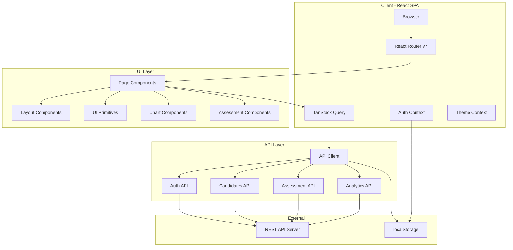
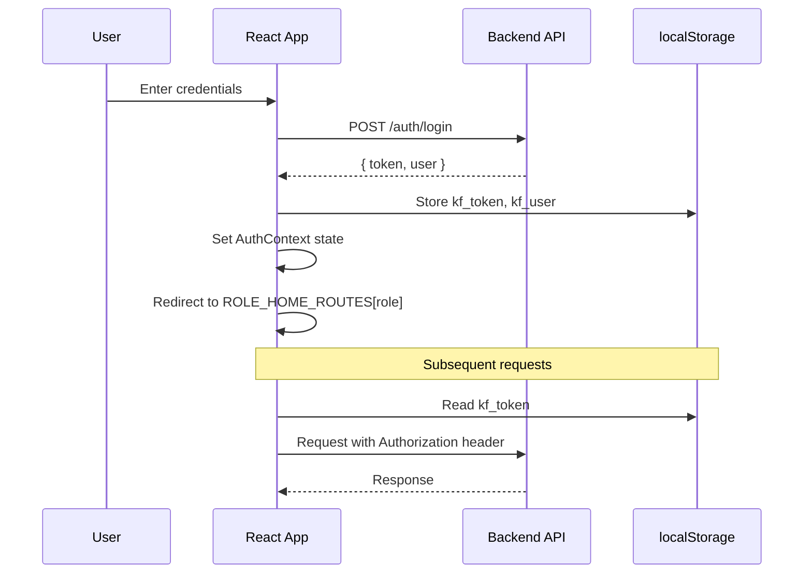
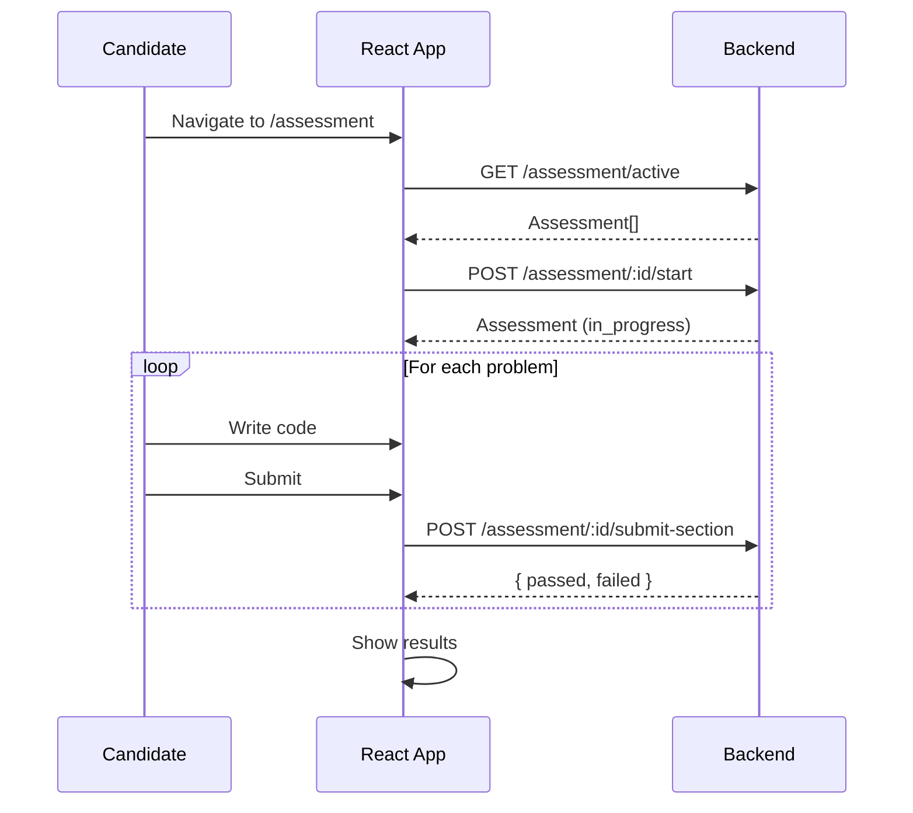
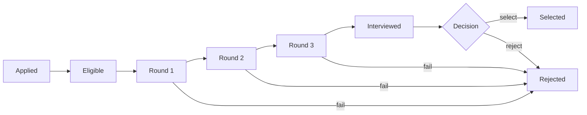

# Knowledge Factory - Technical Documentation

> Comprehensive documentation for the Knowledge Factory intern hiring platform.

---

## Table of Contents

1. [Architecture Overview](#1-architecture-overview)
2. [System Architecture Diagram](#2-system-architecture-diagram)
3. [Technology Stack](#3-technology-stack)
4. [Project Structure](#4-project-structure)
5. [Routing & Navigation](#5-routing--navigation)
6. [API Reference](#6-api-reference)
7. [Type System](#7-type-system)
8. [Authentication & Authorization](#8-authentication--authorization)
9. [Component Library](#9-component-library)
10. [State Management](#10-state-management)
11. [Design System](#11-design-system)
12. [Environment Configuration](#12-environment-configuration)
13. [Development Guide](#13-development-guide)
14. [Role-Based Access Control Matrix](#14-role-based-access-control-matrix)
15. [Data Flow Diagrams](#15-data-flow-diagrams)
16. [Troubleshooting](#16-troubleshooting)

---

## 1. Architecture Overview

Knowledge Factory is a **role-based intern hiring platform** that streamlines high-volume campus recruitment. It supports five user roles, each with dedicated views and workflows:

| Role | Purpose | Home Route |
|------|---------|------------|
| `candidate` | Takes assessments, views portal | `/portal` |
| `hr` | Manages candidates, reviews analytics | `/dashboard` |
| `interviewer` | Conducts interviews, submits feedback | `/interview` |
| `admin` | Full HR + interviewer access | `/dashboard` |
| `superadmin` | Platform-wide org management | `/superadmin` |

The application follows a **single-page application (SPA)** architecture with client-side routing, JWT-based authentication, and a design-system-driven component library.

---

## 2. System Architecture Diagram



---

## 3. Technology Stack

| Category | Technology | Version |
|----------|-----------|---------|
| Framework | React | 19.2.x |
| Language | TypeScript | 6.0.x |
| Build Tool | Vite | 8.0.x |
| Routing | React Router DOM | 7.14.x |
| Data Fetching | TanStack React Query | 5.99.x |
| Styling | Tailwind CSS | 4.2.x |
| Icons | Lucide React | 1.8.x |
| Utility | clsx | 2.1.x |
| Linting | ESLint | 9.39.x |

---

## 4. Project Structure

```
app/
├── public/
│   ├── favicon.svg
│   └── icons.svg
├── src/
│   ├── api/                      # API client & endpoint modules
│   │   ├── client.ts             # Base HTTP client (GET/POST/PUT/PATCH/DELETE)
│   │   ├── auth.ts               # Authentication endpoints
│   │   ├── candidates.ts         # Candidate CRUD endpoints
│   │   ├── assessment.ts         # Assessment & feedback endpoints
│   │   └── analytics.ts          # Analytics & org management endpoints
│   ├── assets/
│   │   └── vite.svg
│   ├── components/
│   │   ├── ui/                   # Design system primitives
│   │   │   ├── index.ts          # Barrel export
│   │   │   ├── Button.tsx
│   │   │   ├── Card.tsx
│   │   │   ├── Badge.tsx
│   │   │   ├── DataTable.tsx
│   │   │   ├── ProgressPipeline.tsx
│   │   │   ├── Modal.tsx
│   │   │   ├── Input.tsx
│   │   │   ├── Select.tsx
│   │   │   ├── Toggle.tsx
│   │   │   ├── Tabs.tsx
│   │   │   └── States.tsx
│   │   ├── layout/               # Shell & navigation
│   │   │   ├── Sidebar.tsx
│   │   │   ├── Header.tsx
│   │   │   ├── AppShell.tsx
│   │   │   └── CandidateNav.tsx
│   │   ├── charts/               # Data visualization
│   │   │   ├── StatCard.tsx
│   │   │   ├── FunnelChart.tsx
│   │   │   └── BarChart.tsx
│   │   └── assessment/           # Assessment-specific components
│   │       ├── Timer.tsx
│   │       ├── ProblemPanel.tsx
│   │       ├── CodeEditor.tsx
│   │       └── TestOutput.tsx
│   ├── contexts/                 # React contexts
│   │   ├── AuthContext.tsx        # Auth state + login/register/logout
│   │   └── ThemeContext.tsx       # Theme state
│   ├── hooks/                    # Custom hooks
│   │   ├── useAuth.ts
│   │   ├── useCandidates.ts
│   │   ├── useAssessment.ts
│   │   └── useAnalytics.ts
│   ├── pages/                    # Route-level components
│   │   ├── Landing.tsx
│   │   ├── auth/
│   │   │   ├── Login.tsx
│   │   │   ├── Register.tsx
│   │   │   ├── OTPVerification.tsx
│   │   │   └── ForgotPassword.tsx
│   │   ├── candidate/
│   │   │   ├── Portal.tsx
│   │   │   └── Assessment.tsx
│   │   ├── hr/
│   │   │   ├── Dashboard.tsx
│   │   │   └── CandidateDetail.tsx
│   │   ├── interviewer/
│   │   │   └── InterviewPanel.tsx
│   │   ├── selection/
│   │   │   └── SelectionPanel.tsx
│   │   ├── analytics/
│   │   │   └── AnalyticsDashboard.tsx
│   │   └── superadmin/
│   │       └── SuperAdminPanel.tsx
│   ├── routes/
│   │   └── ProtectedRoute.tsx    # Role-based route guard
│   ├── types/
│   │   └── index.ts              # All TypeScript interfaces & types
│   ├── utils/
│   │   ├── cn.ts                 # clsx utility wrapper
│   │   └── roles.ts              # Role labels, routes, status maps, access control
│   ├── App.tsx                   # Route definitions
│   ├── main.tsx                  # App bootstrap & providers
│   └── index.css                 # Global styles & Tailwind
├── index.html
├── vite.config.ts
├── tsconfig.json
├── tsconfig.app.json
├── tsconfig.node.json
├── eslint.config.js
├── package.json
└── README.md
```

---

## 5. Routing & Navigation

### Route Map

| Path | Component | Allowed Roles | Type |
|------|-----------|---------------|------|
| `/` | `Landing` | Public | Public |
| `/login` | `Login` | Public | Public |
| `/register` | `Register` | Public | Public |
| `/verify-otp` | `OTPVerification` | Public | Public |
| `/forgot-password` | `ForgotPassword` | Public | Public |
| `/portal` | `Portal` | `candidate` | Protected |
| `/assessment` | `Assessment` | `candidate` | Protected |
| `/dashboard` | `Dashboard` | `hr`, `admin`, `superadmin` | Protected |
| `/candidates/:id` | `CandidateDetail` | `hr`, `admin`, `interviewer`, `superadmin` | Protected |
| `/interview` | `InterviewPanel` | `interviewer`, `admin` | Protected |
| `/selection` | `SelectionPanel` | `hr`, `admin`, `superadmin` | Protected |
| `/analytics` | `AnalyticsDashboard` | `hr`, `admin`, `superadmin` | Protected |
| `/superadmin` | `SuperAdminPanel` | `superadmin` | Protected |
| `*` | `AuthRedirect` | - | Fallback |

### AuthRedirect Behavior

`AuthRedirect` inspects the current auth context:
- **Authenticated** → redirects to `ROLE_HOME_ROUTES[role]`
- **Unauthenticated** → redirects to `/login`

### ProtectedRoute Component

```typescript
// src/routes/ProtectedRoute.tsx
interface ProtectedRouteProps {
  allowedRoles: Role[];
  children: React.ReactNode;
}
```

Wraps protected routes. Checks `useAuth().role` against `allowedRoles`. Unauthorized users are redirected to their role's home route.

---

## 6. API Reference

### Base Client

**File:** `src/api/client.ts`

All API calls go through the `api` object, which wraps `fetch` with:

- Auto-injected `Authorization: Bearer <token>` header from `localStorage.kf_token`
- Auto-injected `Content-Type: application/json`
- Query parameter serialization via `params` option
- Error handling: parses JSON error body, throws `Error` with `message` or `HTTP {status}`

| Method | Signature |
|--------|-----------|
| `api.get<T>` | `(endpoint, options?) → Promise<T>` |
| `api.post<T>` | `(endpoint, data?, options?) → Promise<T>` |
| `api.put<T>` | `(endpoint, data?, options?) → Promise<T>` |
| `api.patch<T>` | `(endpoint, data?, options?) → Promise<T>` |
| `api.delete<T>` | `(endpoint, options?) → Promise<T>` |

**Base URL:** `import.meta.env.VITE_API_URL` or `/api` fallback.

---

### Auth API

**File:** `src/api/auth.ts`

| Endpoint | Method | Body / Params | Response |
|----------|--------|---------------|----------|
| `/auth/register` | POST | `{ name, email, password, resume? }` (FormData if resume) | `{ token, user }` |
| `/auth/login` | POST | `{ email, password }` | `{ token, user }` |
| `/auth/verify-otp` | POST | `{ email, otp }` | `{ token, user }` |
| `/auth/forgot-password` | POST | `{ email }` | `{ message }` |
| `/auth/reset-password` | POST | `{ token, password }` | `{ message }` |
| `/auth/me` | GET | - | `User` |

> **Note:** Registration with resume uses raw `fetch` with `FormData` instead of the JSON client.

---

### Candidates API

**File:** `src/api/candidates.ts`

| Endpoint | Method | Body / Params | Response |
|----------|--------|---------------|----------|
| `/candidates` | GET | `?page=&pageSize=&status=&branch=&college=&search=` | `PaginatedResponse<Candidate>` |
| `/candidates/:id` | GET | - | `Candidate` |
| `/candidates/me` | GET | - | `Candidate` |
| `/candidates/:id/status` | PATCH | `{ status }` | `Candidate` |
| `/candidates/bulk-upload` | POST | `FormData { file }` | Upload result |

> **Note:** Bulk upload uses raw `fetch` with `FormData`.

---

### Assessment API

**File:** `src/api/assessment.ts`

| Endpoint | Method | Body / Params | Response |
|----------|--------|---------------|----------|
| `/assessment/:id/start` | POST | - | `Assessment` |
| `/assessment/:id/submit-section` | POST | `{ problemId, code }` | `{ passed, failed }` |
| `/assessment/:id` | GET | - | `Assessment` |
| `/assessment/active` | GET | - | `Assessment[]` |
| `/candidates/:id/feedback` | POST | `{ technicalScore, communicationScore, recommendation, notes }` | - |

---

### Analytics API

**File:** `src/api/analytics.ts`

| Endpoint | Method | Body / Params | Response |
|----------|--------|---------------|----------|
| `/analytics/funnel` | GET | `?organizationId=` | `FunnelData` |
| `/analytics/dashboard` | GET | `?organizationId=` | `AnalyticsData` |
| `/superadmin/organizations` | GET | - | `Organization[]` |
| `/superadmin/organizations/:id` | PATCH | `Partial<Organization>` | `Organization` |

---

## 7. Type System

**File:** `src/types/index.ts`

### Core Types

```
Role = 'candidate' | 'hr' | 'interviewer' | 'admin' | 'superadmin'
```

```
CandidateStatus = 'applied' | 'eligible' | 'round1' | 'round2' | 'round3'
                | 'interviewed' | 'selected' | 'rejected'
```

### Entity Interfaces

#### User
| Field | Type | Optional |
|-------|------|----------|
| id | `string` | No |
| email | `string` | No |
| name | `string` | No |
| role | `Role` | No |
| avatar | `string` | Yes |
| organizationId | `string` | Yes |

#### Candidate
| Field | Type | Optional |
|-------|------|----------|
| id | `string` | No |
| name | `string` | No |
| email | `string` | No |
| college | `string` | No |
| branch | `string` | No |
| cgpa | `number` | No |
| status | `CandidateStatus` | No |
| resumeUrl | `string` | Yes |
| scores | `AssessmentScore[]` | No |
| proctoringFlags | `ProctoringFlag[]` | No |
| interviewFeedback | `InterviewFeedback` | Yes |
| appliedAt | `string` | No |

#### Assessment
| Field | Type | Optional |
|-------|------|----------|
| id | `string` | No |
| candidateId | `string` | No |
| round | `number` | No |
| problems | `Problem[]` | No |
| startedAt | `string` | Yes |
| completedAt | `string` | Yes |
| timeLimit | `number` | No |
| status | `'not_started' \| 'in_progress' \| 'completed'` | No |

#### Problem
| Field | Type | Optional |
|-------|------|----------|
| id | `string` | No |
| title | `string` | No |
| description | `string` | No |
| difficulty | `'easy' \| 'medium' \| 'hard'` | No |
| starterCode | `string` | No |
| testCases | `TestCase[]` | No |

#### TestCase
| Field | Type | Optional |
|-------|------|----------|
| id | `string` | No |
| input | `string` | No |
| expectedOutput | `string` | No |
| isHidden | `boolean` | No |

#### AssessmentScore
| Field | Type | Optional |
|-------|------|----------|
| round | `number` | No |
| score | `number` | No |
| maxScore | `number` | No |
| completedAt | `string` | No |

#### ProctoringFlag
| Field | Type | Optional |
|-------|------|----------|
| id | `string` | No |
| type | `'tab_switch' \| 'face_not_detected' \| 'multiple_faces' \| 'copy_paste'` | No |
| timestamp | `string` | No |
| details | `string` | No |

#### InterviewFeedback
| Field | Type | Optional |
|-------|------|----------|
| technicalScore | `number` | No |
| communicationScore | `number` | No |
| recommendation | `'select' \| 'reject'` | No |
| notes | `string` | No |
| interviewerId | `string` | No |
| interviewerName | `string` | No |
| completedAt | `string` | No |

### Data Transfer Interfaces

#### FunnelData
| Field | Type |
|-------|------|
| applied | `number` |
| eligible | `number` |
| assessed | `number` |
| interviewed | `number` |
| selected | `number` |

#### AnalyticsData
| Field | Type |
|-------|------|
| passRatePerRound | `{ round: string; passRate: number }[]` |
| collegeBreakdown | `{ college: string; count: number; avgScore: number }[]` |
| branchPerformance | `{ branch: string; count: number; avgScore: number }[]` |
| proctoringViolations | `{ type: string; count: number }[]` |

#### Organization
| Field | Type | Optional |
|-------|------|----------|
| id | `string` | No |
| name | `string` | No |
| candidateCount | `number` | No |
| activeHiringCycles | `number` | No |
| plan | `'starter' \| 'professional' \| 'enterprise'` | No |

#### PaginatedResponse\<T\>
| Field | Type |
|-------|------|
| data | `T[]` |
| total | `number` |
| page | `number` |
| pageSize | `number` |
| totalPages | `number` |

---

## 8. Authentication & Authorization

### Flow



### Auth Context API

**File:** `src/contexts/AuthContext.tsx`

| Property | Type | Description |
|----------|------|-------------|
| `user` | `User \| null` | Current authenticated user |
| `token` | `string \| null` | JWT token |
| `isLoading` | `boolean` | Auth operation in progress |
| `role` | `Role \| null` | Shortcut for `user?.role` |
| `login(email, password)` | `() → Promise<void>` | Authenticate & store credentials |
| `register(name, email, password, resume?)` | `() → Promise<void>` | Create account & store credentials |
| `logout()` | `() → void` | Clear credentials & state |

### Token Storage

| Key | Content | Set By |
|-----|---------|--------|
| `kf_token` | JWT bearer token | login, register |
| `kf_user` | JSON-serialized `User` | login, register |

### Route Protection

`ProtectedRoute` wraps route elements:
1. Reads `role` from `AuthContext`
2. Checks if `role` is in `allowedRoles` prop
3. If unauthorized → redirects to user's home route
4. If unauthenticated → redirects to `/login`

---

## 9. Component Library

### UI Primitives (`src/components/ui/`)

| Component | Purpose | Key Props |
|-----------|---------|-----------|
| `Button` | Primary, secondary (ghost), tertiary actions | `variant`, `size`, `disabled`, `loading` |
| `Card` | Content container with tonal surface | `children`, surface variant classes |
| `Badge` | Status / label indicators | status-dependent color classes |
| `DataTable` | High-density tabular data | Row data, columns, alternating fills |
| `ProgressPipeline` | Segmented bar for hiring pipeline | Stage data, pulse animation |
| `Modal` | Floating glassmorphic overlay | `open`, `onClose`, `children` |
| `Input` | Text input fields | `label`, `error`, `type` |
| `Select` | Dropdown selection | `options`, `value`, `onChange` |
| `Toggle` | Boolean switch | `checked`, `onChange` |
| `Tabs` | Tabbed navigation | `tabs`, `activeTab`, `onChange` |
| `States` | Empty, loading, error states | `state`, `message` |

### Layout Components (`src/components/layout/`)

| Component | Purpose | Used By |
|-----------|---------|---------|
| `Sidebar` | Vertical navigation panel | Admin/HR views |
| `Header` | Top bar with user info | All authenticated views |
| `AppShell` | Sidebar + Header + content wrapper | Admin/HR layout |
| `CandidateNav` | Glass-style top nav | Candidate views |

### Chart Components (`src/components/charts/`)

| Component | Purpose |
|-----------|---------|
| `StatCard` | Single metric display card |
| `FunnelChart` | Hiring funnel visualization |
| `BarChart` | Comparative bar visualization |

### Assessment Components (`src/components/assessment/`)

| Component | Purpose |
|-----------|---------|
| `Timer` | Countdown timer for assessment rounds |
| `ProblemPanel` | Problem description display |
| `CodeEditor` | Code input area |
| `TestOutput` | Test case result display (passed/failed/hidden) |

---

## 10. State Management

### Strategy

| Concern | Approach | Location |
|---------|----------|----------|
| Auth state | React Context | `AuthContext` |
| Theme state | React Context | `ThemeContext` |
| Server state | TanStack Query | Custom hooks |
| UI state | Component-local `useState` | Individual components |

### TanStack Query Configuration

```typescript
// src/main.tsx
const queryClient = new QueryClient({
  defaultOptions: {
    queries: {
      staleTime: 30_000,      // 30 seconds
      retry: 1,               // Single retry
      refetchOnWindowFocus: false,
    },
  },
})
```

### Custom Hooks

| Hook | File | Purpose |
|------|------|---------|
| `useAuth` | `src/hooks/useAuth.ts` | Re-exports `AuthContext` |
| `useCandidates` | `src/hooks/useCandidates.ts` | Query candidates with filters |
| `useAssessment` | `src/hooks/useAssessment.ts` | Assessment CRUD operations |
| `useAnalytics` | `src/hooks/useAnalytics.ts` | Analytics data fetching |

---

## 11. Design System

Based on `Design.md` specifications.

### Color Palette

| Token | Hex | Usage |
|-------|-----|-------|
| `primary` | `#001d28` | Primary actions, gradient start |
| `primary_container` | `#063342` | Sidebar, gradient end |
| `secondary` | `#006a62` | Success, AI insights, progress |
| `secondary_container` | `#6cf5e6` | Completed states |
| `surface` | `#f9f9ff` | Base layer (Layer 0) |
| `surface_container_low` | `#eff3ff` | Main content (Layer 1) |
| `surface_container_lowest` | `#ffffff` | Cards, interactive (Layer 2) |
| `surface_bright` | - | Active/popover (Layer 3) |
| `on_surface` | `#121c2a` | Primary text |
| `on_tertiary_container` | `#8c97a9` | Labels, metadata |
| `outline_variant` | - | Ghost borders (15% opacity) |

### Surface Hierarchy

```
Layer 0 (Base)           surface (#f9f9ff)
  └─ Layer 1 (Content)  surface_container_low (#eff3ff)
       └─ Layer 2 (Card)  surface_container_lowest (#ffffff)
            └─ Layer 3 (Popover)  surface_bright + Glassmorphism
```

### Design Rules

| Rule | Implementation |
|------|----------------|
| No 1px borders | Use tonal shifts between surfaces |
| No drop shadows on cards | Use surface layer contrast |
| Ghost border fallback | `outline_variant` at 15% opacity |
| Glassmorphism | `backdrop-blur: 12-20px` on floating elements |
| Gradient CTAs | `primary → primary_container` at 135deg |
| No pure black text | Use `on_surface` (#121c2a) |
| Border radius | `0.375rem` (md) as base |
| Data tables | No divider lines; alternate row fills |
| Progress bars | Segmented bar with pulse animation |

### Typography

| Scale | Usage | Style |
|-------|-------|-------|
| Display (lg/md) | Dashboard metrics | Tight tracking (-0.02em) |
| Headline/Title | Nav headers, card titles | `on_surface` color |
| Body (md/sm) | Data tables, content | Line-height 1.5 for density |
| Label (md/sm) | Metadata, captions | `on_tertiary_container` color |

---

## 12. Environment Configuration

| Variable | Required | Default | Description |
|----------|----------|---------|-------------|
| `VITE_API_URL` | No | `/api` | Backend API base URL |

Set in `.env` or `.env.local` at the project root.

---

## 13. Development Guide

### Prerequisites

- Node.js 18+
- npm 9+

### Setup

```bash
cd app
npm install
```

### Development Server

```bash
npm run dev
```

Starts Vite dev server with hot module replacement.

### Build

```bash
npm run build
```

Runs TypeScript type-check (`tsc -b`) then Vite production build.

### Lint

```bash
npm run lint
```

Runs ESLint with React hooks and React Refresh plugins.

### Preview Production Build

```bash
npm run preview
```

### Provider Hierarchy

```tsx
<StrictMode>
  <QueryClientProvider>
    <BrowserRouter>
      <ThemeProvider>
        <AuthProvider>
          <App />
        </AuthProvider>
      </ThemeProvider>
    </BrowserRouter>
  </QueryClientProvider>
</StrictMode>
```

### Adding a New Page

1. Create component in `src/pages/<section>/NewPage.tsx`
2. Import in `src/App.tsx`
3. Add `<Route>` with `ProtectedRoute` wrapper specifying `allowedRoles`
4. If new role, update `src/utils/roles.ts` (`ROLE_LABELS`, `ROLE_HOME_ROUTES`, `canAccessRoute`)

### Adding a New API Endpoint

1. Define endpoint function in appropriate `src/api/*.ts` file
2. Use `api.get/post/put/patch/delete` from `client.ts`
3. Add types to `src/types/index.ts` if needed
4. Create a custom hook in `src/hooks/` wrapping TanStack Query

---

## 14. Role-Based Access Control Matrix

### Route Access

| Route | candidate | hr | interviewer | admin | superadmin |
|-------|:---------:|:--:|:-----------:|:-----:|:----------:|
| `/portal` | X | | | | |
| `/assessment` | X | | | | |
| `/dashboard` | | X | | X | X |
| `/candidates/:id` | | X | X | X | X |
| `/interview` | | | X | X | |
| `/selection` | | X | | X | X |
| `/analytics` | | X | | X | X |
| `/superadmin` | | | | | X |

### API Access (Enforced by Backend)

API endpoints should enforce the same role restrictions server-side. The client-side `ProtectedRoute` is a UX optimization, not a security boundary.

---

## 15. Data Flow Diagrams

### Candidate Assessment Flow



### HR Hiring Pipeline



### Candidate Status Color Mapping

| Status | Background | Text Color |
|--------|-----------|------------|
| applied | `surface-variant/40` | `on-surface-variant` |
| eligible | `info/15` | `info` |
| round1 | `secondary/15` | `secondary` |
| round2 | `secondary/20` | `secondary` |
| round3 | `secondary/25` | `secondary` |
| interviewed | `info/15` | `info` |
| selected | `secondary/10` | `secondary` |
| rejected | `danger/15` | `danger` |

---

## 16. Troubleshooting

| Issue | Cause | Solution |
|-------|-------|----------|
| Blank page after login | `ROLE_HOME_ROUTES` missing for role | Add mapping in `src/utils/roles.ts` |
| 401 on API calls | Token expired or missing | Check `localStorage.kf_token`; logout and re-login |
| Route shows blank | User role not in `allowedRoles` | Check `ProtectedRoute` config in `App.tsx` |
| Build fails | TypeScript errors | Run `npx tsc --noEmit` to see errors |
| Styles not applying | Missing Tailwind class | Verify `index.css` has `@import "tailwindcss"` |
| Candidate detail 404 | Backend not running | Ensure API server is running at `VITE_API_URL` |
| Bulk upload fails | CORS or auth issue | Verify `Authorization` header in upload request |

---

## 17. Production Checklist Progress

Progress against the [Vibe Coding Checklist](https://www.praneethkalluri.com/vibe-coding-checklist).

### Category Status

| # | Category | Status | Notes |
|---|----------|--------|-------|
| 01 | Databases & Data | ✓ DONE | `deleted_at`, `created_at`, `updated_at`, `created_by`, `updated_by` added to all models |
| 02 | Secrets & Access | ✓ DONE | JWT secret rotated. `.env.dev`, `.env.staging`, `.env.prod` templates created. Production env never committed |
| 03 | Auth & Authorization | ✓ DONE | `POST /api/auth/confirm-password` + `DELETE /api/auth/delete-account` implemented. Re-auth required for destructive actions |
| 04 | Cost & Controls | ✓ DONE | `LOGIN_RATE_LIMIT=10/m`, `CODE_EXEC_RATE_LIMIT=20/m` configured. `BILLING_ALERTS.md` ops doc created |
| 05 | Deployment & Environment | ✓ DONE | `backup_db.sh` script, `UPTIME_MONITORING.md`, `ENVIRONMENTS.md` docs created |
| 06 | Monitoring & Observability | ✓ DONE | `TimedRotatingFileHandler` (logs/app.log, 7-day retention) + Sentry SDK initialized in `main.py` |
| 07 | Security & Privacy | ✓ DONE | Cookie consent banner (`CookieConsent.tsx`), `/privacy` + `/terms` pages, bleach input sanitization added |
| 08 | Error Handling | ⏳ PENDING | Per-endpoint error responses need consistent schema across all routes |
| 09 | Performance | ⏳ PENDING | DB indexes on foreign keys. Async queries. SQLite → PostgreSQL migration for production |
| 10 | Legal & Compliance | ✓ DONE | Privacy Policy + Terms of Service pages live at `/privacy`, `/terms` |
| 11 | Maintenance & Operations | ✓ DONE | `DISASTER_RECOVERY.md`, `backup_db.sh`, env rotation, production checklist tracked here |

### Remaining Tasks

- **Category 08**: Standardize error response schema ( `{ error: string; detail?: string; code?: string }` ) across all route files
- **Category 09**: Add `index=True` to all foreign key columns; migrate from SQLite to PostgreSQL before production

---

## Assumptions & Gaps

| Item | Status |
|------|--------|
| Backend API spec | Not available; endpoints inferred from client code |
| Test suite | No tests found in project |
| CI/CD pipeline | Not configured |
| Error boundary | Not implemented |
| Refresh token flow | Not implemented (token stored indefinitely) |
| Proctoring implementation | Type definitions exist; integration TBD |
| Theme toggle | `ThemeContext` exists; dark mode implementation pending |
| Accessibility audit | Not performed |

---

*Documentation generated from source code analysis. All API contracts are client-side inferences and should be verified against the actual backend implementation.*
